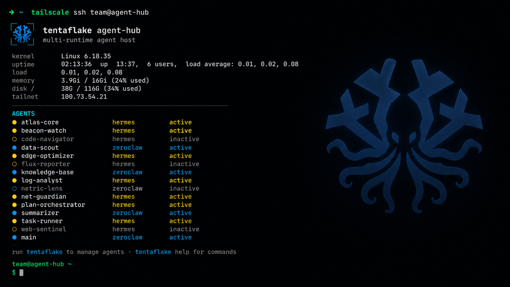

# 🪼 Tentaflake — NixOS Flake Template for Multi-Agent Hosting

> Deploy isolated AI agents on a single headless machine.
> One NixOS brain · Many tentacles.

> **What agents does this run?** Tentaflake supports two agent runtimes side by side: [Hermes](https://github.com/NousResearch/hermes-agent), an open-source AI agent daemon from Nous Research, and **ZeroClaw**, a second agent runtime you can declare with `mkZeroClawAgent`. Both connect to LLM providers (OpenRouter, Anthropic, OpenAI), run tools (terminal, web search, file access), and can be customized per agent. Tentaflake gives you a turnkey way to run one or many agents — of either runtime — on a dedicated machine.

<p align="center">
  <a href="https://tentaflake.dev"></a>
  <a href="https://github.com/timfewi/tentaflake/actions"></a>
  <a href="LICENSE"></a>
  
</p>

<p align="center">
  <br/>
  
  <p align="center">
    <i>Declaratively deploy & manage multiple isolated AI agents (Hermes, ZeroClaw)
    on a single NixOS machine — each with its own secrets, skills, and personality.</i>
    <br/>
    <sub>Clone → configure → rebuild. Your swarm, your NixOS, your rules.</sub>
  </p>
</p>

---

## What Is Tentaflake?

**Tentaflake** is a **NixOS** (Linux distro configured entirely in code) template for running multiple isolated **AI agents** on one machine, across two supported runtimes — **Hermes** and **ZeroClaw**. Each agent lives in its own Docker container with its own secrets, skills, and personality. Hermes agents can also share a container as a team using **Hermes Profiles** — multiple personas, different skills, shared resources, all in a single container. Define all your agents in one file — the template handles servers, secrets, networking, and shells.

No SaaS, no third-party agent router — you host, you control. Clone → configure → rebuild.

---

## Quick Comparison — Choose Your Path

| You want to… | Start here | What you get |
|---|---|---|
| **Try it with zero commitment** | [⚡ Path 1: Live USB](#⚡-path-1-try-it-now--live-usb) | Boot from USB, agents run in RAM, nothing touches disk |
| **Install NixOS permanently** | [💾 Path 2: Installer ISO](#💾-path-2-install-permanently--installer-iso) | Boot from USB, TUI wizard installs NixOS + agents to disk |
| **Already use NixOS, want agents** | [🛠️ Path 3: Customize Agents](#🛠️-path-3-customize-your-agents) or [🔧 Flake Input](#🔧-for-nixos-experts-consume-as-flake-input) | Add `tentaflake` module to your existing config |

---

## ⚡ Path 1: Try It Now — Live USB

Boot any x86_64 machine from a USB stick. Agents run entirely in **RAM** — pull the USB and every trace is gone. Requires no NixOS install, no existing Nix setup.

> **You need some way to build the ISO.** The build machine is separate from the target — any Linux, macOS, or Windows box can do it. You have three options:

<details>
<summary><b>Option A: Install Nix on any Linux/macOS (recommended, 5 minutes)</b></summary>

Nix is a **package manager** — NOT NixOS the operating system. It runs on Ubuntu, Fedora, Debian, macOS, Arch, and most other Linux distros, sitting happily alongside `apt`/`dnf`/`brew`.

```bash
# Install Nix on any Linux or macOS — works alongside your existing tools
curl --proto '=https' --tlsv1.2 -L https://nixos.org/nix/install | sh

# Restart your shell or source the profile
. "$HOME/.nix-profile/etc/profile.d/nix.sh"
```

Then follow the build steps below.
</details>

<details>
<summary><b>Option B: Use Docker to build (no Nix install needed)</b></summary>

Don't want to install Nix? Run it in a container instead. Works on any machine with Docker (Linux, macOS, Windows):

```bash
# Clone the repo
git clone https://github.com/timfewi/tentaflake
cd tentaflake

# Use the official Nix Docker image to build the ISO
docker run --rm -v "$PWD:/build" -w /build nixos/nix \
  sh -c "nix build .#live-agent-iso --extra-experimental-features 'nix-command flakes'"

# ISO appears at result/iso/tentaflake-live.iso
```
</details>

<details>
<summary><b>Option C: Download a pre-built ISO (if available)</b></summary>

Check the [GitHub Releases](https://github.com/timfewi/tentaflake/releases) page — pre-built ISOs may be available for download. No build step needed, just download and write to USB.
</details>

### What You Need

- A machine with **8 GB+ RAM** (the target machine — Docker image ~2 GB lives in RAM)
- A USB stick (8 GB+)
- A build machine (any Linux, macOS, or Windows box — see options above)

### Build the ISO

If going with Option A (install Nix) or Option B (Docker), clone and build:

```bash
# Get the code
git clone https://github.com/timfewi/tentaflake
cd tentaflake

# Build the live ISO (takes a few mins first time)
nix build .#live-agent-iso --extra-experimental-features 'nix-command flakes'
#     ^^^^   ^^^^^^^^^^^^^^^^
#     |      output named "live-agent-iso" from this flake
#     "nix build" builds an output (package, ISO, config)
#     .# means "from the flake in the current directory"
```

When done, the ISO is at `result/iso/tentaflake-live.iso`.
(`nix build` creates a `result` symlink pointing to the build output.)

### Write to USB

> ⚠️ **Destructive.** Triple-check `of=` is your USB device, not your disk.

```bash
lsblk                           # identify your USB, e.g. /dev/sdX
sudo dd if=result/iso/tentaflake-live.iso of=/dev/sdX bs=4M status=progress oflag=sync
```

The ISO is a **UEFI + legacy-BIOS hybrid** — boots on modern and older machines.

### Boot and Set Up

1. Boot target machine from the USB (boot menu: usually F10/F12/Esc).
2. A text-mode login screen appears (TTY1) — the **firstboot wizard** starts automatically.
3. Enter at minimum an **OpenRouter API key**. Optional: Telegram bot token, Firecrawl key, Groq key.
4. The wizard writes keys to RAM and starts the agent containers. **Piper TTS** (text-to-speech, for voice interactions) is already serving at `http://localhost:5001/v1`.
5. Start chatting: `docker exec -it hermes-default hermes chat`

### Skip the Wizard (Unattended Boot)

Put `.env` files on a **second** USB labeled `HERMES_ENV`:

```bash
sudo mkfs.ext4 -L HERMES_ENV /dev/sdY1     # label is what matters
# copy default.env, research.env onto it
```

On boot the system auto-detects the label, copies env files in, starts agents **without prompting**.

### Persist Data Across Reboots

By design nothing survives a reboot. To keep agent memory and learned skills, attach a USB labeled `HERMES_DATA`:

```bash
sudo mkfs.ext4 -L HERMES_DATA /dev/sdZ1
```

At boot, each agent's state dir redirects onto that USB. Without it, the system stays fully ephemeral.

### RAM Requirements

| Machine RAM | Experience |
|---|---|
| **< 4 GB** | Not enough — Docker image pull fills the overlay |
| **4–8 GB** | Tight; one or two agents |
| **8 GB+** | Comfortable for default agents |

---

## 💾 Path 2: Install Permanently — Installer ISO

Build a bootable USB that installs NixOS + Tentaflake to disk via an interactive TUI wizard.

### Prerequisites

- A machine to build the ISO (see [build options](#-path-1-try-it-now--live-usb) in Path 1 — install Nix, use Docker, or download a pre-built release)
- A USB stick (8 GB+)
- A target machine (x86_64) with a blank disk or one you're willing to wipe

### Build the ISO

```bash
git clone https://github.com/timfewi/tentaflake
cd tentaflake
nix build .#installer-iso
# ISO at result/iso/tentaflake.iso
```

Or use the convenience script: `./scripts/build-iso.sh installer`

> 💡 **No Nix installed?** See Path 1 for [Docker build](#-path-1-try-it-now--live-usb) or [pre-built ISO](#-path-1-try-it-now--live-usb) options — same methods work for the installer ISO.

### Write to USB

```bash
sudo dd if=result/iso/tentaflake.iso of=/dev/sdX bs=4M status=progress oflag=sync
```

### Boot and Install

1. Boot from USB on target machine.
2. The **TUI installer** launches automatically on TTY1.
3. Walk through the wizard (dialog-based):
   - Set hostname, username, password
   - Select target disk (**ALL DATA WILL BE WIPED**)
   - Set timezone
   - Confirm — then installer partitions (1 GB EFI + ext4 root), generates hardware config (auto-detects disks, GPU, network), runs `nixos-install` (10–15 min — NixOS compiles your system from config, downloading and building all packages)
4. After completion, system reboots into your new NixOS machine with Hermes ready.

### After Install

SSH in over Tailscale (`ssh admin@<hostname>`) and you land in a ready-to-operate
shell: a login banner shows host + agent health across all runtimes, and the `tentaflake`
command drives the agent containers (`tentaflake status`, `tentaflake logs <name>`,
`tentaflake restart <name>`, `tentaflake shell <name>`). A deprecated `hermes` shim
still works and execs `tentaflake` with a warning. See [`docs/06-shell.md`](docs/06-shell.md).

<p align="center">
  
  <br/>
  <sub>SSH into the host and the login banner shows every agent — Hermes and ZeroClaw — with live status.</sub>
</p>

Then follow the [quickstart guide](docs/01-quickstart.md) to set up agent providers and start chatting.

---

## 🛠️ Path 3: Customize Your Agents

If you already have NixOS running (or just finished Path 2), define your agents with a **my-agents.nix** file and rebuild.

### Agent Definition File

Create `my-agents.nix` in the repo root. Here's a quick Nix syntax primer (it's simpler than it looks):

```
# Nix crash course (enough to edit this file):
#   { key }: expr       = function that takes an object with key "key"
#   { a = 1; b = 2; }  = object ("attrset"), semicolons NOT commas
#   [ x y z ]          = list (space-separated)
#   mkF ({...})        = function call
```

```nix
# my-agents.nix — each item in these lists becomes one isolated agent container
{ mkHermesAgent, mkZeroClawAgent }:   # helpers that create agent modules, one per runtime

let
  hermesAgents = [
    {
      name    = "coding";
      envFile = "/run/secrets/hermes-coding.env";
      settings = {
        model.default = "openrouter/anthropic/claude-sonnet-4";
        model.provider = "openrouter";
        terminal.backend = "docker";
        toolsets = [ "terminal" "memory" "file" "skills" ];
      };
    }

    {
      name    = "research";
      envFile = "/run/secrets/hermes-research.env";
      settings = {
        model.default = "openrouter/deepseek/deepseek-v4-flash";
        web.backend = "firecrawl";
        toolsets = [ "terminal" "web" "memory" "file" "skills" ];
      };
    }
  ];

  zeroclawAgents = [ ]; # mkZeroClawAgent {...} entries — see my-agents.nix.example
in
map mkHermesAgent hermesAgents ++ map mkZeroClawAgent zeroclawAgents
```

> Old single-arg `{ mkHermesAgent }: ...` files (no `zeroclawAgents`) keep working —
> the runner only passes the builders your file actually asks for.

Each Hermes agent gets:
- System user `hermes-<name>`
- State dir `/var/lib/hermes-<name>` (0700, owned by agent user)
- Docker container `hermes-<name>` (host networking, auto-start)
- `HERMES_HOME` pointing to its state dir

Each ZeroClaw agent (`mkZeroClawAgent`) gets the analogous layout under the
`zeroclaw-<name>` prefix — container `zeroclaw-${name}`, state dir
`/var/lib/zeroclaw-${name}`, config rendered from `settings` to a mounted
`config.toml`, secrets via `agenixFile` (see [`zeroclaw.env.example`](zeroclaw.env.example)
for the `ZEROCLAW_<section>__<sub>__<key>` env convention). Full reference
in [`my-agents.nix.example`](my-agents.nix.example).

### Common `mkHermesAgent` Options

| Option | Type | Default | Description |
|---|---|---|---|
| `name` | `string` | *(required)* | Agent identifier |
| `envFile` | `path` | `null` | Path to `.env` file with API keys |
| `agenixFile` | `path` | `null` | Path to agenix-decrypted env file |
| `image` | `string` | `nousresearch/hermes-agent:latest` | OCI container image |
| `seedDir` | `path` | `null` | Dir with SOUL.md, AGENTS.md, skills/ (skills are reusable capabilities — like plugins — that extend what an agent can do, e.g. web search, file operations) |
| `settings` | `attrset` | `null` | Hermes config.yaml (model routing, toolsets, etc.) |
| `autoStart` | `bool` | `true` | Auto-start with systemd |
| `networkMode` | `string` | `"host"` | `"host"` or `"bridge"` |
| `extraVolumes` | `list` | `[]` | Extra `host:container:mode` mounts |

#### Operational hardening (all optional, default-off)

| Option | Type | Description |
|---|---|---|
| `containerUid` / `containerGid` | `int` | UID/GID the container runs as; state dirs are owned by it (default `10000`, the image's `hermes` user). Prevents `PermissionError` on `$HERMES_HOME` |
| `healDataDirs` | `list` | Extra mounted data dirs to `chown` to the container uid each boot (rebuilds heal ownership) |
| `providerHealthcheck` | `attrset` | Fail-loud boot preflight: POSTs a 1-token completion, logs PASS/FAIL + HTTP status so a bad `base_url`/key isn't mistaken for an agent crash |
| `gitIdentity` | `attrset` | Set git identity inside the container, re-applied each boot |
| `gitAutoPush` | `attrset` | Push the agent's repos from the **host** with a token the agent never sees (Hermes strips secrets from the agent terminal) |
| `dashboard` | `attrset` | Launch + optionally tailnet-publish the agent dashboard |
| `services` | `attrset` | Run + optionally tailnet-publish durable agent-built web apps |

See [`docs/07-operations.md`](docs/07-operations.md) for the persistence model, the
UID/secret/`config.yaml` gotchas, and the rationale behind each option.

Full option reference: [`.agents/skills/tentaflake-repo-guidance/SKILL.md`](.agents/skills/tentaflake-repo-guidance/SKILL.md)

### Common `mkZeroClawAgent` Options

| Option | Type | Default | Description |
|---|---|---|---|
| `name` | `string` | *(required)* | Agent identifier |
| `agenixFile` | `path` | *(required)* | Env file mounted into the container (`--env-file`) — API keys as `ZEROCLAW_<section>__<sub>__<key>` overrides |
| `image` | `string` | `ghcr.io/zeroclaw-labs/zeroclaw:v0.8.2` | OCI container image |
| `hostPort` / `servePort` | `int` | *(required)* | Host loopback → container gateway port, and the tailnet HTTPS port `tailscale serve` publishes it on |
| `settings` | `attrset` | `{ }` | ZeroClaw `config.toml` (model routing, runtime profiles, risk profiles, etc.) |
| `seedDir` | `path` | `null` | Workspace dir copied in on first boot only, same no-clobber semantics as Hermes' `seedDir` |
| `autoStart` | `bool` | `true` | Auto-start with systemd |
| `extraEnvironment` / `extraVolumes` | `attrset` / `list` | `{ }` / `[ ]` | Extra container env vars / `host:container:mode` mounts |

See [`my-agents.nix.example`](my-agents.nix.example) and [`zeroclaw.env.example`](zeroclaw.env.example) for a fully-commented reference agent.

### Secrets: Two Patterns

**1. `.env` file (simpler, local-only)**

```nix
mkHermesAgent {
  name    = "my-agent";
  envFile = "/run/secrets/my-agent.env";
}
```

```bash
sudo mkdir -p /run/secrets
sudo cp hermes.env.example /run/secrets/my-agent.env
sudo chmod 600 /run/secrets/my-agent.env
sudo vi /run/secrets/my-agent.env   # add OPENROUTER_API_KEY=sk-or-...
```

Never commit `.env` files to Git.

**2. Agenix (encrypted in Git)**

**Agenix** is a tool that encrypts secrets as `.age` files — safe to commit, decrypted only at NixOS activation time (runtime, not evaluation).

```nix
mkHermesAgent {
  name       = "my-agent";
  agenixFile = "/run/agenix/my-agent-env";
}
```

Full guide: [`docs/04-agenix-secrets.md`](docs/04-agenix-secrets.md)

> ZeroClaw agents (`mkZeroClawAgent`) only take `agenixFile` (no `envFile` option) —
> copy [`zeroclaw.env.example`](zeroclaw.env.example) the same way and point `agenixFile` at it.

### Rebuild to Apply

```bash
git add my-agents.nix          # flakes only evaluate Git-tracked files
nix flake check                # validates syntax + evaluation (like tsc --noEmit)
sudo nixos-rebuild switch --flake .#agent-host
#     ^^^^^^^^^^^^^^^^       ^^^^^^^^^^^^^^^^^
#     build + apply config   use host config named "agent-host" from flake
#     "switch" activates it  (defined in flake.nix, change via tentaflake.hostName)
```

New agents appear as Docker containers. Remove an agent from the list, rebuild — container is pruned.

---

## 🏗️ Architecture

```
                      Agent Orchestration
                   One NixOS brain · Many tentacles

                           ,---------.
                         ,'  NixOS    `.
                        (    Flake      )
                 ┌───────`. (Config)  ,' ──────┐──────────────┐
                 │         `---------'         │              │
                 │              │              │              │
           /=====▼====\   /=====▼====\   /=====▼====\   /=====▼====\
           │ Tentacle │   │ Tentacle │   │ Tentacle │   │ Tentacle │
           │ Agent A  │   │ Agent B  │   │ Agent C  │   │ Agent N  │
           │ (coding) │   │(research)│   │(personal)│   │   (...)  │
           │          │   │          │   │          │   │          │
           │📦 Docker │   │📦 Docker │   │📦 Docker │   │📦 Docker │
           │User:     │   │User:     │   │User:     │   │User:     │
           │hermes-A  │   │hermes-B  │   │hermes-C  │   │hermes-N  │
           │State:    │   │State:    │   │State:    │   │State:    │
           │/var/lib/ │   │/var/lib/ │   │/var/lib/ │   │/var/lib/ │
           │hermes-A  │   │hermes-B  │   │hermes-C  │   │hermes-N  │
           │          │   │          │   │          │   │          │
           │🔑 Key: A │   │🔑 Key: B │   │🔑 Key: C │   │🔑 Key: N │
           │📚 Skills │   │📚 Skills │   │📚 Skills │   │📚 Skills │
           │          │   │          │   │          │   │          │
           \==========/   \==========/   \==========/   \==========/

       ───────────────── Shared Services ─────────────────
      🎤 Piper TTS   🔗 Tailscale   🗄️ Docker   🔐 Agenix
      (port 5001)    (mesh VPN)     (runtime)    (secrets)

   📝 Hermes Profiles: multiple agent personas can share one container
   (e.g. "coding" + "personal" as different profiles in the same Docker
   container) — ideal for collaborative teams. Security-critical agents
   still get their own container.
```

Tentacles shown are Hermes agents (`hermes-<name>`); ZeroClaw agents follow
the same one-container-per-agent shape under a `zeroclaw-<name>` prefix.

### Key Design Decisions

| Decision | Rationale |
|---|---|
| **One container per agent** (or share via Profiles) | Full isolation — no shared context, separate filesystems. **Hermes Profiles** let multiple agent personas (different skills, secrets, personalities) run inside a single container for collaborative teams, while keeping per-container isolation for security-critical agents |
| **Host networking** | Containers use the host's network stack directly — agents reach Piper, Tailscale, etc. on `localhost` without port mapping |
| **SeedDir over :ro volumes** | Hermes can write learned skills; base files seed once, never overwrite |
| **Agenix or envFile** | Choose between encrypted-in-repo or plain-file secrets |
| **Template stays generic** | This repo is a template. Fork it, add your agents, keep your secrets. |

### Available Modules

| Module | What it configures |
|---|---|
| `boot.nix` | systemd-boot, EFI, kernel params |
| `hardening.nix` | Sysctl hardening, AppArmor, journald limits |
| `locale.nix` | Timezone, locale, console keymap |
| `networking.nix` | Hostname, nftables firewall, NetworkManager |
| `nix-settings.nix` | Flakes, auto-GC, trusted-users, substituters |
| `packages.nix` | curl, git, jq, tmux, vim, and more |
| `users.nix` | Admin user (wheel + networkmanager groups) |
| `shell.nix` | SSH/console operator experience — `tentaflake` CLI (deprecated `hermes` shim still works), login banner, prompt, zsh/oh-my-zsh, zoxide, lazygit, modern CLI tools ([docs](docs/06-shell.md)) |
| `editor.nix` | Optional Neovim via nvf (LSP, treesitter, telescope) — `tentaflake.editor.nvf.enable`, exported as `nixosModules.editor` ([docs](docs/06-shell.md#zsh-zoxide-lazygit-neovim)) |
| `ssh.nix` | Opt-in hardened OpenSSH (key-only, no root login, max 3 auth tries) + fail2ban, opens TCP 22 — off by default, Tailscale SSH is the primary access path |
| `tailscale.nix` | Tailscale with SSH + tag:auto (optional) |
| `piper-tts-server.nix` | Local TTS via Piper (OpenAI-compatible API) |
| `hermes-auditd.nix` | Filesystem audit daemon (watches state dirs of agent containers on **every** runtime) + `tentaflake top` TUI + the **Agent Console** web file explorer & live monitor — [docs](docs/06-shell.md#agent-console--web-file-explorer--live-monitor) |
| **Hermes Profiles** | *(no module needed)* Run multiple agent personas inside a single container. Configure via `hermes profile create` — each profile gets its own personality, skills, model config, and toolsets while sharing the container's secrets and runtime |

### Available ISOs

| ISO | Build | Purpose |
|---|---|---|
| **Live Agent ISO** | `nix build .#live-agent-iso` | Run agents + TTS in RAM, no disk write ([Path 1](#⚡-path-1-try-it-now--live-usb)) |
| **Installer ISO** | `nix build .#installer-iso` | Bootable TUI wizard, installs to disk ([Path 2](#💾-path-2-install-permanently--installer-iso)) |

### Common Commands

```bash
nix flake check                          # validate everything builds
nix build .#installer-iso                # build installer ISO
nix build .#live-agent-iso               # build live ISO
nix build .#hermes-auditd                # build audit daemon package
sudo nixos-rebuild switch --flake .#agent-host  # deploy config
sudo nixos-rebuild dry-activate --flake .#agent-host  # dry-run
sudo nixos-rebuild switch --rollback     # undo last deploy
tentaflake status                        # all agents, any runtime, with health
docker ps --filter "name=hermes-"        # list running Hermes agents
docker ps --filter "name=zeroclaw-"      # list running ZeroClaw agents
docker logs hermes-coding                # view agent logs
docker exec -it hermes-coding hermes chat  # chat with a Hermes agent
```

---

## 📚 Learning Nix

New to NixOS? These resources will get you up to speed:

| Resource | What it covers |
|---|---|
| [Zero to Nix](https://zero-to-nix.dev) | The fastest intro — Nix language, flakes, dev shells |
| [nix.dev](https://nix.dev) | Official Nix tutorials and guides |
| [NixOS Manual](https://nixos.org/manual/nixos/stable/) | Official NixOS reference |
| [Nix Pills](https://nixos.org/guides/nix-pills/) | Deep-dive into Nix internals |
| [NixOS Flakes Book](https://nixos-and-flakes.thiscute.world) | Practical flake guide |

Key concepts used in this project:

- **Flake** — a Git-tracked Nix project with a `flake.nix` entry point and `flake.lock` lockfile that pins every dependency version. `nix build .#foo` builds output `foo`.
- **`nixos-rebuild switch --flake .#host`** — builds and activates the NixOS configuration named `host` from the flake in the current directory.
- **Derivation** — a build recipe (any `.drv` file). `nix build` turns derivations into build results (packages, ISOs, etc.).
- **`nix flake check`** — validates the flake: syntax, evaluation, and builds all checks.

---

## 🔧 For NixOS Experts: Consume as Flake Input

Add tentaflake as a dependency to your own flake — useful when you already have a NixOS config and just want the agent modules:

```nix
# your-flake.nix
{
  inputs.tentaflake = {
    url = "github:timfewi/tentaflake";
    inputs.nixpkgs.follows = "nixpkgs";  # align nixpkgs version
  };

  outputs = { self, nixpkgs, tentaflake, ... }:
  let
    system = "x86_64-linux";
    mkHermesAgent = tentaflake.lib.${system}.mkHermesAgent;
    mkZeroClawAgent = tentaflake.lib.${system}.mkZeroClawAgent;
  in {
    nixosConfigurations.my-host = nixpkgs.lib.nixosSystem {
      inherit system;
      specialArgs = { inherit mkHermesAgent mkZeroClawAgent; };
      modules = [
        tentaflake.nixosModules.default    # all base modules
        {
          tentaflake.hostName = "my-machine";
          tentaflake.adminUser = "alice";
          tentaflake.timeZone = "Europe/Vienna";
        }
        ./hardware-configuration.nix
      ] ++ import ./my-agents.nix { inherit mkHermesAgent mkZeroClawAgent; };
    };
  };
}
```

> The direct call above requires your `my-agents.nix` to accept both arguments
> (`{ mkHermesAgent, mkZeroClawAgent }:` — or add `...`). An older
> `{ mkHermesAgent }:`-only file works unmodified inside this repo's
> `configuration.nix` (it only passes what the function asks for), but for the
> flake-input form shown here, pass only the builders your file declares.

You get:
- **`tentaflake.nixosModules.default`** — all NixOS modules with `tentaflake.*` options
- **`tentaflake.lib.x86_64-linux.mkHermesAgent`** / **`mkZeroClawAgent`** — agent builder helpers, one per runtime
- **`tentaflake.lib.x86_64-linux.constants`** — default values (hostname, stateVersion, locale)

See [`examples/consumer-flake.nix`](examples/consumer-flake.nix) for a full worked example including agenix and home-manager.

---

## ⬆️ Upgrading from v0.1.x (breaking)

v0.2.0 renames the host operator surface and makes the host agent-agnostic.
Compatibility bridges keep old setups running through the transition, but they
are deprecated and will be removed in a future release:

| What changed | Old | New | Bridge (temporary) |
|---|---|---|---|
| Host operator CLI | `hermes` | `tentaflake` | shim warns on stderr, then forwards |
| Shell option | `tentaflake.shell.hermesCli.enable` | `tentaflake.shell.tentaflakeCli.enable` | `mkRenamedOptionModule` eval warning |
| `my-agents.nix` signature | `{ mkHermesAgent }:` | `{ mkHermesAgent, mkZeroClawAgent }:` | in-repo import passes only the args your file declares |

To migrate: switch scripts and habits to `tentaflake`, rename the option in your
config, and move `my-agents.nix` to the two-list layout from
[`my-agents.nix.example`](my-agents.nix.example). Flake-input consumers calling
`import ./my-agents.nix { inherit mkHermesAgent mkZeroClawAgent; }` directly must
update old single-arg files (or add `...`). Also note `tentaflake ps` now lists
agent containers of **all runtimes including stopped ones**, and the Agent
Console / `tentaflake top` label non-Hermes agents with a runtime prefix
(`zeroclaw-<name>`). Nothing changes **inside** your agent containers.

---

## 🤝 Contributing

This is a **generic template** — keep it that way. No domain-specific code, real hostnames, API keys, or company config.

1. Fork the repo
2. Create a feature branch (`git checkout -b feat/amazing`)
3. Commit using [Conventional Commits](https://www.conventionalcommits.org/) (`feat:`, `fix:`, `docs:`)
4. Run `nix flake check` and `go test ./...` in `pkgs/hermes-auditd/`
5. Open a Pull Request

See [`CONTRIBUTING.md`](CONTRIBUTING.md) for full details.

---

## 📄 License

MIT — see [LICENSE](LICENSE).
Piper voice models distributed under their respective MIT licenses.
